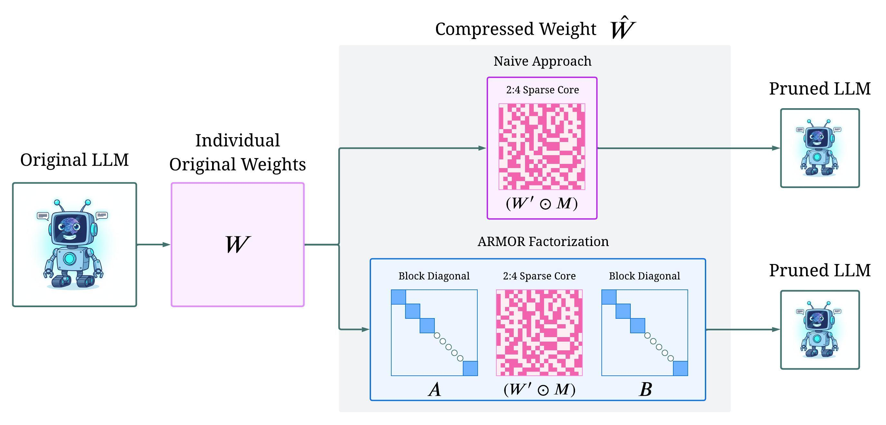

# ARMOR: High-Performance Semi-Structured Pruning via Adaptive Matrix Factorization
[Lawrence Liu](https://lawrencerliu.github.io)<sup>1</sup>, [Alexander Liu](https://www.linkedin.com/in/alexander-liu-2472b8264/), [Mengdi Wang](https://mwang.princeton.edu/)<sup>3</sup>, [Tuo Zhao](https://www2.isye.gatech.edu/~tzhao80/)<sup>2</sup>, [Lin F. Yang](http://drlinyang.net/)<sup>1</sup><br>
<sup>1</sup> UCLA, <sup>2</sup> Georgia Tech, <sup>3</sup> Princeton University<br>



## Overview
This is the official implementation of ARMOR, a new 2:4 semi-structured pruning method that leverages adaptive matrix factorization. ARMOR signficantly outperforms existing naive 2:4 semi-structured pruning methods such as Wanda and SparseGPT. Sample results for Qwen2.5 7B/14B/32B/72B are shown below. More results can be found in our [paper](ADD PAPER LINK).


## Requirements
- Python 3.13.2+
- Miniconda/Anaconda
- Cuda

## Installation
We use two seperate virtual enviroments, one main enviroment `ARMOR_main` for pruning and perplexity evaluation, and one enviroment `ARMOR_eval` for LM evaluation harness based evaluation. This is because there are some dependency conflicts between `hydra` and certain tasks in `lm-evaluation-harness` such as `math`.
```bash
# Clone the repository
git clone {REPO_URL}
cd ARMOR


# Armor main needs to be generated from pip due to dependency conflicts
conda create -n ARMOR_main python=3.13.2 -y
conda activate ARMOR_main
python -m pip install -r requirements_main.txt

# Armor eval can be generated from conda
conda env create -f eval_env.yml
```

## Usage
We have included automated scripts to generate the calibration data and run the pruning and evaluation. 
In the scripts there is a variable `gpus` that specifies which gpus to use, currently it is customized for our machine, please change it to fit your machine.
```bash
# llama-2 compression 
scripts/replicate/compress_llama2.bash <model_name>
# llama-3 compression
scripts/replicate/compress_llama3.bash <model_name>
# Qwen2.5/Qwen3 compression 
scripts/replicate/qwen_compress.bash <model_name> [num_processes]
```
On the Qwen scripts there is an optional argument `num_processes` that specifies how many processes to use for data parallel for evaluation. If not specified, it will use as many processes as available gpus. However on larger models such as 70B, it is necessary to perform both data parallelism and model parallelism, so you may need to specify `num_processes` to be less than the number of available gpus.
### Baselines 
We have also included a modified version of the [Wanda](https://github.com/locuslab/wanda) in `wanda-main` folder. We modified the original Wanda codebas to work with the updated `transformers` and `datasets` libraries. We have included an automated script to run and evaluatie Wanda and SparseGPT pruning on Qwen models.
```bash
# Qwen2.5/Qwen3 compression with Wanda or SparseGPT
scripts/baselines/qwen_compress.bash <model_name> <wanda/sparsegpt> [num_processes]
```

Since this repository was built ontop the [NoWag](https://github.com/LawrenceRLiu/NoWag) repository, we have also included a script to run and evaluate NoWag pruning on Qwen models.
```bash
# Qwen2.5/Qwen3 compression with NoWag
scripts/baselines/NoWag_P.bash <model_name> [num_processes]
```
## Contact And Additional Information
For questions or issues, please contact [lawrencerliu@ucla.edu](mailto:lawrencerliu@ucla.edu)